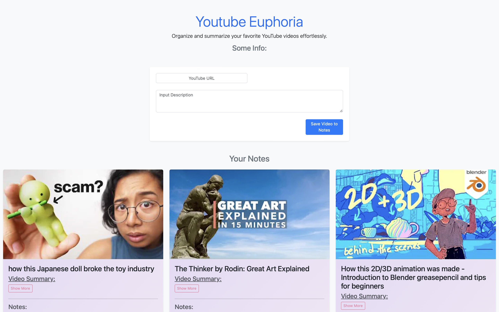

# [Project Youtube Euphoria](https://niclokt.github.io/pgfm-batch2/)

^ _(Link to Project embedded in title)_

### Project Pitch

```
See a youtube video that might provide some interesting insights?

But no time and brain power to sit through the video and process it's contents?

That's where Youtube Euphoria comes into play!
Get your dose of dopamin regardless of time and day!
A click of a button, Youtube Euphoria coming your way!
```

### Introducing ✨Youtube Euphoria✨:



### How to use?:

1. Simply copy the youtube url from your browser's navigation bar.
2. Paste the url of the youtube video of interest into the input box.
3. That's it! A card with a link to the video and summary of it's content will be created.

## Design Process

`Provide us insights about your design process, focusing on who this website is for, what it is that they want to achieve and how your project is the best way to help them achieve these things.`

### Target Audience:

-   Anyone who watches youtube for knowledge

### Audience's pain points:

-   Have to make the effort to make notes
-   Have to sit through the entire video to get the gist of the content
-   Might have to re-watch the video a few times to digest videos with more complex content

### Project Value Proposition

-   Organises and stores summarised version of video into cards
-   Users can easily come to view the cards for a quick recap on the videos

### List of User Stories:

`This section is also where you would share links to any wireframes, mockups, diagrams etc. that you created as part of the design process.
These files should themselves either be included as a pdf file in the project itself (in an separate directory)
Include the Adobe XD wireframe as a folder. You can include the XD share url.`

#### [1] User Stories

##### US #1

> As a user type, I want to create video cards with a concise summary of the videos, so that I can get the gist of the video at a glance.

##### US #2

> As a user type, I want to be able to make notes and be able to edit it after creating the card, so that I can list follow up actions or personal insights related to the video, OR insights gleaned from the content.

##### US #3

> As a user type, I want to be able to delete video cards that I've created, so that I can re-organise my video card dashboard.

##### US #4

> As a user type, I want to be able to collapse the summary section, so that I can keep the look and feel of my dashboard need, without it looking too cluttered with content.

#### [2] Links to Figjam and wireframe

-   [FigJam / Wireframe](https://www.figma.com/board/82uw41Elgv8nKGA3PcHpf6/Programming-Fundamentals-Project-Organiser?node-id=0-1&t=xCUfvc0QzRjc4VJu-1)

## Features

`In this section, you should go over the different parts of your project, and describe each in a sentence or so.`

### Existing Features

-   **URL input feature**
    -   Allows users to indicate their video of interest, by having them paste the url link into the textbox.
-   **Video Cards**
    -   Allows users to keep the information/ summary for each video modular, by encapsulating the content in a video card
-   **Collapsible Summary**
    -   Allows users to collapse the summary sections of the various video cards, such that it keeps the interface neat.
-   **Edit Notes**
    -   For users that might be using this web app for studying, it allows them to make and edit notes for reference by clicking on the `edit` button, to make edits to their notes in the textbox and clicking on `save` to save their changes.
-   **Last Updated DateTime:**
    -   Enables user to track when their last edit was made, but checking the footer of the card
-   **Delete Card**
    -   Enables users to remove the video cards, by clicking on the 'delete' button.

### Features Left to Implement

`In addition, you may also use this section to discuss plans for additional features to be implemented in the future:`

-   Draggable/ Rearrangeable cards
-   Search function
-   Filter function (E.g. By video title, date updated, duration)
-   Introduce Tabs to organise Video cards into various cateogories
-   display hashtags related to the video

## Technologies Used

`In this section, you should mention all of the languages, frameworks, libraries, and any other tools that you have used to construct this project. For each, provide its name, a link to its official site and a short sentence of why it was used.`

-   [Bootstrap](https://getbootstrap.com/docs/5.3/components/collapse/)
    -   Simplifies the process of beautifying frontend
-   [Marked](https://marked.js.org)
    -   Converts markdown script into HTML code
-   [Youtube Detail API](https://rapidapi.com/ytjar/api/yt-api)

    -   Get info on youtube video (e.g. Video Title)
    -   Found in `script.js` under section `MAIN API FUNCTIONS`, in `getVideoDetails()` function

-   [Youtube Transcript API]()

    -   Get transcipt of youtube video
    -   Found in `script.js` under section `MAIN API FUNCTIONS`, in `fetchTranscript()` function

-   [Groq](https://console.groq.com/docs/api-reference#chat)
    -   Get summary of video transcript using Llama LLM model
    -   Model: `llama3-8b-8192`
    -   Found in `script.js` under section `MAIN API FUNCTIONS`, in `getGroqChatCompletion()` function

## Testing

`For any scenarios that have not been automated, test the user stories manually and provide as much detail as is relevant. A particularly useful form for describing your testing process is via scenarios, such as:`

#### 1. Submittitng of Youtube URL:

    1. Copy url of desired youtube video
    2. Paste it in the text box
    3. Click "Save Video to Notes" button
    4. A video card, with the thumbnail of the desired video and summarised version of the transcript should appear in the dashboard below

#### 2. Editing the 'Notes' section of the video card

    1. Go to an existing video card.
    2. Click on the "show more" button under "Notes", to expand any notes that might have been saved previously.
    3. Click on "Edit Notes", the text should convert into an editable text field.
    4. Make changes to the text in the editable text field.
    5. Click "Save" to save changes, editable text field should convert back into text and should display the updated text that was saved.
    6. Refresh the page, go back to the same card.
    7. Click on the "show more" button under "Notes", the text display should be the same as what was last updated by user.

#### 3. Deleting a video card:

    1. Go to an existing video card.
    2. Click the "Delete" button, the video card should no longer be displayed no the dashboard.
    3. Refresh the webpage, the previously removed video card should still be displayed no the dashboard.

### Bugs:

`You should also mention in this section any interesting bugs or problems you discovered during your testing, even if you haven't addressed them yet.  `

#### Bug #1 - Edit Button functionality

-   The edit button only works if you click on the edit button in the first video card. Afterwhich the edit button will work for the rest of the videos.

#### Bug #2 - Delete button

-   Only works occasionally

### Webpage Responsivity:

`In addition, you should mention in this section how your project looks and works on different browsers and screen sizes.`

-   At the moment it only works well on a laptop
-   More improvements can be made while viewing from a small screen or mobile device.

## Credits

### Content

-   N.A.

### Media

-   The videos used in this site were obtained from youtube.

### Acknowledgements

-   I received inspiration for this project from pinterest's dashboard
