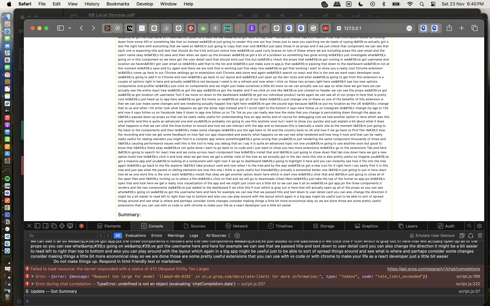

```
# Notes template (To remove)
This is the first para
&nbsp; This is the 2nd para
&ensp; &ensp; This is the 3rd para (both ensp and nbsp acheives the samee indent effect)
> (This is a blockquote) This is the 4th para
```

---

# Assignment Documentation

`~~Date: 16 NOV 2024, SAT~~`  
`Status: WIP, 16 NOV 2024`

### [Summary]

_(To summarise at the end of the lesson)_  
Some learning points:

1. LP 1
2. LP 2

### [Useful Links]

### APIs

// For getting transcript

1. [Instagram Video Transcript](https://rapidapi.com/info-kAsZdTpxN/api/instagram-video-transcript/playground/apiendpoint_eeb64b16-9385-4955-86cb-a2c47c1ae23d)

// For getting caption

1.

// For summarising transcript / text

1. [Groq](https://console.groq.com/docs/overview)

// For getting word cloud / for doing text extraction??
[]()

// For getting youtube detail:

1.

// Makeshift Youtube API

1. [YouTube Transcripts](https://rapidapi.com/rafalzawadzki/api/youtube-transcripts/pricing) --> 100 requests /mth
2. [Youtube Transcript](https://rapidapi.com/solid-api-solid-api-default/api/youtube-transcript3/pricing) --> 100/ mth
3. [](https://rapidapi.com/benrhzala90/api/youtube-transcriptor/pricing) --> 20/mth

// Makeshift Insta API

1. [proxytube](https://rapidapi.com/forcequit/api/proxytube) --> 30 requests/mth
2. [Instagram Scraper API](https://rapidapi.com/social-api1-instagram/api/instagram-scraper-api2) --> 500/mth ✅✅
3. [Instagram Bulk Scraper Latest](https://rapidapi.com/mrngstar/api/instagram-bulk-scraper-latest/playground/apiendpoint_26d5e416-abc2-4144-936d-f965c6f4f779) --> 100/mth

// Services: Website hosting

1. [Netlify](https://www.netlify.com)
2. [Render](https://render.com)

    **Benefits**:

    - More control to deployment
    - as we move on in development, it should be public facing
    - Can use the hosting website to deploy

// Services: Managing Data

1. [jsonBin](https://jsonbin.io)
    - Can use to implement RBAC (very simple implementation)
    - Can treat a bin like one big json file to maintain
    - keep access key as const
    - Can use it as extra storage space (up to 100KB)
    - Tricky thing would be to edit data --> (code implementation wise) need to retrieve from bin and put back back
2. [restDB.io](https://restdb.io)
    - has a web interface
    - noSQL database, the whole thing is like a json object
    - interface looks like an excel sheet, but when reading
    - Data should be secure, it should be like some sort of backend access
    - can use API to make use of RESTful services to call
    -

// Free Maps

1. [MapBox](https://www.mapbox.com)
2. [OpenMaps](https://www.openstreetmap.org/#map=12/1.3649/103.8229)

### Documentation & Ref Materials

1. [Bootstrap Component Examples](https://getbootstrap.com/docs/5.3/examples/)
2. [Groq Supported Models](https://console.groq.com/docs/models)
3. [YT: How to get Post details by url](https://youtu.be/L_JFOCyJOVU?si=I2WhikH5HJCH51e8)
4. [YT: How to scrape instagram data](https://youtu.be/hz9tSv3CP6k?si=V_6vFGtS3Z973ONa)
5. [Marked library to display markdown in HTML](https://marked.js.org)

### Good practise

1. Create button
2. Immediately after, create an event listener
3. Environment Variable (Possible on GitHub as well)

### Some Considerations:

1. **Security**
    - Not too secure to deploy everything frontend
    - Because when you POST and GET it will be exposed
    - Front-facing only API service, usually the data is not important
    - Need to deploy both frontend and backednd
    - Only useful if you can hide the API-key on the server side when you deploy with backend
    - Hard to hide, since we don't have the initial authentication (Like logging into an account)
    - Some API providers can usually have a `2 way handshake`
    - Can view APIs on website, in inspect page - "network" tab

## Today's Agenda

1. Recap
2. Item 1
3. Item 2
4. Item 3

## 01 -- RECAP

## 02 -- Concepts for further reading

1. `Callbacks`
2.

## 03 -- Learning Points (Mistakes & Boundary Testing)

1. Functions wrapping APIs

    - Should be declared as an async function
    - "await" should be used when calling these async functions

2. Conditions

    - Ensure the code is comparing the right variables for validation

3. Stress testing
    - Groq API is unable to process prompt with too much words
    - Tried getting a summary for a 15 hr video and the api call failed hahaha...
    - [Video used for stress testing](https://www.youtube.com/watch?v=x4rFhThSX04)
    - 

## 04 --

## 05 --

## 06 --

## zz -- Garble Garble...

xx -- Interesting ways to implement code

---

> Code 1

```
For multiline code highlighting, keep it sandwiched between 2 3xbackticks
```

> Code 2

```
Well this has been interesting
```

> Code 3

```
Hope I take better notes with this in the future :3
```

yy -- Markdown Reference

---

[Markdown Cheat Sheet] (https://github.com/adam-p/markdown-here/wiki/markdown-cheatsheet)
